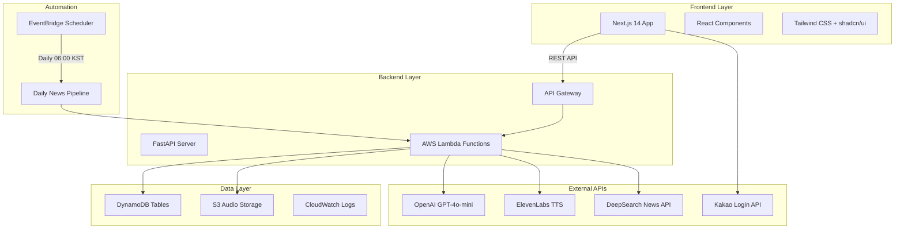

# Briefly - AIニュースポッドキャストプラットフォーム

毎日更新されるパーソナライズAIニュースポッドキャストサービス

[ユーチューブデモ動画を見る](https://youtu.be/fDMx_1knq70)

[](https://aws.amazon.com/)
[](https://openai.com/)
[](https://elevenlabs.io/)
[](https://nextjs.org/)
[](https://fastapi.tiangolo.com/)

---

## 1. 開発目標

### 1.1 プロジェクトビジョン
Brieflyは現代人の情報消費パターンの変化に対応し、AI技術を活用したパーソナライズニュースポッドキャストプラットフォームの構築を目指します。ユーザーが忙しい日常の中でも効率的に重要なニュースを聴取できるよう支援し、個人の関心に合わせた高品質なオーディオコンテンツを提供します。

### 1.2 主要目標
- 完全自動化：ニュース収集から音声生成まで無人自動化システムを構築
- パーソナライズサービス：ユーザーの関心カテゴリに基づくカスタマイズコンテンツを提供
- 高品質音声：ElevenLabs TTSを活用した自然な韓国語ポッドキャスト生成
- 効率的な要約：GPT-4o-miniと二重クラスタリングによる重複除去と重要情報抽出
- アクセシビリティ：Webとモバイルでいつでも利用可能なユーザーフレンドリーなインターフェース

### 1.3 ターゲットユーザー
- 忙しくてニュースを読む時間がない社会人
- 通勤時間を活用して情報を得たいユーザー
- 特定分野の継続的な情報アップデートが必要な専門家
- 視覚的コンテンツより聴覚的コンテンツを好むユーザー

---

## 2. アーキテクチャ設計

### 2.1 全体システムアーキテクチャ



### 2.2 データベース設計

#### DynamoDBテーブル構造
- NewsCards: 収集したニュース記事を保存 (PK: news_id, GSI: category-date)
- Frequencies: 生成されたポッドキャスト原稿と音声情報 (PK: frequency_id, GSI: category-date)
- Users: ユーザープロファイルと設定情報 (PK: user_id)
- Bookmarks: ユーザーブックマーク管理 (PK: user_id-news_id)

#### S3バケット構造
```
briefly-news-audio/
├── frequencies/
│   ├── politics/
│   │   └── 2025-01-01.mp3
│   ├── economy/
│   │   └── 2025-01-01.mp3
│   └── ...
└── temp/
    └── processing/
```

### 2.3 サービスレイヤーアーキテクチャ

#### バックエンドサービス構成
- OpenAI Service: GPT-4o-miniを活用したニュース要約と二重クラスタリング
- TTS Service: ElevenLabs APIによる韓国語音声合成
- DeepSearch Service: ニュース収集と本文抽出
- Auth Service: カカオソーシャルログインとJWTトークン管理

#### フロントエンドコンポーネント構成
- ページコンポーネント: 各ルートごとのメインページ構成
- UIコンポーネント: shadcn/uiベースの再利用可能なコンポーネント
- ビジネスコンポーネント: ニュースカード、オーディオプレーヤーなどドメイン特化型コンポーネント

---

## 3. 開発詳細

### 3.1 AIベースのニュース処理システム

#### 二重クラスタリングアルゴリズム
1. 1次クラスタリング：元記事の物理的重複除去（80%類似度基準）
2. 2次クラスタリング：GPT要約文の意味的重複除去（75%類似度基準）
3. トークン最適化：本文1,500字制限でAPIコスト50%削減

#### GPT-4o-mini活用最適化
- Few-shot Learning：カテゴリごとの例示に基づく一貫した品質の原稿生成
- コンテキスト管理：カテゴリごとのトーン＆マナー適用
- エラーハンドリング：Rate LimitやAPIエラーへの堅牢な例外処理

### 3.2 音声生成とストリーミング

#### ElevenLabs TTS統合
- 韓国語最適化：eleven_multilingual_v2モデル活用
- 音声品質設定：Stability 0.4、Similarity Boost 0.75
- ストリーミング対応：S3 Presigned URLによるリアルタイム再生

#### オーディオファイル管理
- 自動アップロード：TTS生成直後にS3保存
- URL管理：7日間有効なPresigned URL自動更新
- 圧縮最適化：MP3形式でファイルサイズ最小化

### 3.3 自動化パイプライン

#### 毎朝6時自動実行
```python
# EventBridgeスケジューラー設定
Events:
  DailyNewsSchedule:
    Type: Schedule
    Properties:
      Schedule: "cron(0 21 * * ? *)"  # UTC基準（KST 06:00）
      Target:
        Arn: !GetAtt NewsCollectionFunction.Arn
```

#### 並列処理最適化
- カテゴリごとに並列収集：6カテゴリ同時処理
- バッチサイズ最適化：カテゴリごとに30記事収集
- 失敗処理：自動リトライとロギングシステム

### 3.4 ユーザーインターフェース

#### レスポンシブデザイン
- モバイルファースト：タッチフレンドリーなインターフェース設計
- ダークテーマ：目の疲れを軽減するダークモード
- アニメーション：Framer Motionによるスムーズな遷移効果

#### ユーザー体験最適化
- ワンクリックログイン：カカオソーシャルログイン簡単連携
- パーソナライズオンボーディング：関心カテゴリ選択によるカスタマイズ
- 直感的ナビゲーション：下部タブベースの主要機能アクセス

---

## 4. 実装結果

### 4.1 完成機能一覧

#### ユーザー認証と管理（3ユースケース）
- UC-001：カカオソーシャルログイン完全実装
- UC-002：ユーザープロファイル管理システム
- UC-003：関心カテゴリ設定とパーソナライズ

#### ニュース閲覧と探索（3ユースケース）
- UC-004：カテゴリ別ニュースリスト取得（Top10＋もっと見る）
- UC-005：ニュース詳細表示とブックマーク機能
- UC-006：個人ブックマーク管理システム

#### ポッドキャストサービス（2ユースケース）
- UC-007：個人向け周波数再生（関心カテゴリベース）
- UC-008：カテゴリ別周波数聴取と履歴

#### パーソナライズと設定（3ユースケース）
- UC-009：ユーザープロファイル統合管理
- UC-010：関心カテゴリのリアルタイム編集
- UC-011：オンボーディングプロセス完成

#### 自動化システム（2ユースケース）
- UC-012：毎日自動ニュース収集（6カテゴリ×30記事）
- UC-013：自動ポッドキャスト生成とTTS変換

### 4.2 パフォーマンス指標

#### システム処理性能
- ニュース収集：180記事/日（6カテゴリ×30記事）
- 重複除去率：物理的80%＋意味的75%の二重フィルタリング
- ポッドキャスト生成：6音声ファイル/日（カテゴリ別）
- 応答時間：API平均応答時間2秒未満

#### コスト最適化
- トークン使用量：本文1,500字制限で50%削減
- TTSコスト：カテゴリごとに1日1回生成で最適化
- S3ストレージ：圧縮MP3ファイルで保存効率化

### 4.3 技術スタック完成度

#### フロントエンド（100%完成）
- Next.js 14：App RouterベースのモダンWebアプリケーション
- TypeScript：型安全性保証
- Tailwind CSS＋shadcn/ui：一貫したデザインシステム
- Framer Motion：スムーズなアニメーション効果

#### バックエンド（100%完成）
- FastAPI：高性能REST APIサーバー
- AWS Lambda：サーバーレスアーキテクチャ
- DynamoDB：NoSQLデータベース
- S3：オーディオファイルストレージ

#### AIサービス統合（100%完成）
- OpenAI GPT-4o-mini：ニュース要約と原稿生成
- ElevenLabs TTS：韓国語音声合成
- DeepSearch API：ニュース収集と本文抽出

---

## 5. 期待効果

### 5.1 ユーザー価値の提供

#### 時間効率
- 情報消費時間短縮：30分のニュース読書→5分のポッドキャスト聴取
- マルチタスク対応：運動・通勤中にも情報取得可能
- 重要情報集中：AI要約による重要内容のみ厳選提供

#### パーソナライズ体験
- カスタマイズコンテンツ：関心分野中心のパーソナライズニュースキュレーション
- 適応型サービス：ユーザーパターン学習による継続的改善
- アクセシビリティ向上：視覚障害者など多様なユーザー層をサポート

### 5.2 技術的イノベーション効果

#### AI技術活用
- 二重クラスタリング：従来の単純重複除去より精度向上
- コスト最適化：本文1,500字制限で運用効率性向上
- 品質向上：GPT-4o-mini活用で自然な要約文生成

#### 自動化システム
- 無人運用：人手をかけず24/7自動コンテンツ生成
- 拡張性：カテゴリや言語拡張が容易なモジュール構造
- 安定性：エラーハンドリングとリトライロジックでサービス継続性保証

### 5.3 ビジネスインパクト

#### 市場差別化
- 独自サービス：AIベースのパーソナライズニュースポッドキャスト先導モデル
- 技術競争力：最新AI技術統合による高い参入障壁
- ユーザー体験：直感的UI/UXで高いユーザー満足度達成

#### 拡張可能性
- 多言語対応：多様な言語でサービス拡張可能
- コンテンツ多様化：ニュース以外の情報コンテンツにも拡張可能
- プラットフォーム連携：多様なプラットフォームとの連携可能性

### 5.4 社会的価値

#### 情報アクセス性向上
- デジタル格差解消：音声ベースサービスで多様なユーザー層を包摂
- 情報の民主化：AI要約による公平な情報アクセス機会提供
- メディアリテラシー：重要情報中心の効率的な情報消費文化の醸成

#### 技術発展への貢献
- AI実用化：実サービスでのAI技術活用事例提示
- オープンソース貢献：開発過程で得た知見をコミュニティと共有
- イノベーション促進：新しい形のメディアサービスモデルを提案

---

## プロジェクト構成

### Frontend (Next.js 14 + TypeScript)

```
frontend/
├── app/                          # Next.js App Router
│   ├── layout.tsx               # ルートレイアウト
│   ├── page.tsx                 # ホームページ（ランキングへリダイレクト）
│   ├── ranking/                 # ランキングシステム
│   │   └── page.tsx            # 人気ニュースランキングページ
│   ├── today/                   # 今日のニュース
│   │   └── page.tsx            # カテゴリ別ニュースリスト
│   ├── frequency/               # マイ周波数（ポッドキャスト）
│   │   └── page.tsx            # パーソナライズドポッドキャストリスト
│   ├── profile/                 # ユーザープロファイル
│   │   ├── page.tsx            # プロファイルページ
│   │   └── categories/page.tsx  # 関心カテゴリ設定
│   ├── news/[id]/              # ニュース詳細
│   │   └── page.tsx            # 個別ニュース詳細表示
│   ├── onboarding/             # オンボーディング
│   │   └── page.tsx            # 初期設定とカテゴリ選択
│   └── login/kakao/callback/   # 認証
│       └── page.tsx            # カカオログインコールバック処理
│
├── components/                   # 再利用コンポーネント
│   ├── ui/                      # shadcn/ui基本コンポーネントライブラリ
│   ├── page-header.tsx          # ページ上部ヘッダー
│   ├── navigation-tabs.tsx      # 下部タブナビゲーション
│   ├── category-filter.tsx      # カテゴリフィルタリング
│   ├── news-card.tsx           # ニュースカードコンポーネント
│   ├── news-carousel.tsx       # ニュースカルーセルスライダー
│   ├── audio-player.tsx        # 音声再生プレーヤー
│   ├── frequency-card.tsx      # 周波数カードコンポーネント
│   └── bookmark-button.tsx     # ブックマークトグルボタン
│
├── lib/                         # ユーティリティと設定
│   ├── api.ts                  # REST APIクライアント
│   ├── utils.ts                # 共通ユーティリティ関数
│   ├── constants.ts            # 定数定義（カテゴリ、URLなど）
│   ├── auth.ts                 # 認証関連ユーティリティ
│   └── mock-data.ts            # 開発用モックデータ
│
└── types/                       # TypeScript型定義
    ├── api.ts                  # API関連型
    ├── user.ts                 # ユーザー関連型
    └── news.ts                 # ニュース関連型
```

### Backend (FastAPI + AWS Serverless)

```
backend/
├── app/
│   ├── main.py                 # FastAPIメインアプリケーション
│   │
│   ├── constants/               # 定数定義
│   │   └── category_map.py     # カテゴリマッピング（韓国語↔英語）
│   │
│   ├── services/               # コアビジネスロジック
│   │   ├── openai_service.py   # GPT要約＋Few-shot learning
│   │   ├── deepsearch_service.py # ニュース収集＋本文抽出
│   │   └── tts_service.py      # ElevenLabs TTS音声変換
│   │
│   ├── utils/                  # ユーティリティモジュール
│   │   ├── dynamo.py          # DynamoDB接続とクエリ
│   │   ├── jwt_service.py     # JWTトークン生成/検証
│   │   ├── date.py            # 日付処理（KST基準）
│   │   └── s3_utils.py        # S3ファイルアップロード/ダウンロード
│   │
│   ├── routes/                # REST APIルーター
│   │   ├── auth.py           # カカオログイン/ログアウト
│   │   ├── user.py           # ユーザープロファイル/設定管理
│   │   ├── news.py           # ニュース取得/検索/ブックマーク
│   │   ├── frequency.py      # 周波数（ポッドキャスト）管理
│   │   └── category.py       # カテゴリ取得
│   │   
│   │
│   └── tasks/                 # バッチ処理とスケジューラー
│       ├── scheduler.py       # 毎日6時メインスケジューラー
│       ├── collect_news.py    # ニュース収集パイプライン
│       └── generate_frequency.py # 音声生成パイプライン
│      
│
├── test/                      # ユニットテスト
│   ├── run_all_tests.py      # 全テスト実行
│   ├── test_frequency_unit.py # 周波数生成テスト
│   ├── test_clustering.py    # クラスタリングアルゴリズムテスト
│   ├── test_tts_service.py   # TTSサービステスト
│   └── README.md             # テストガイド
│
├── template.yaml             # AWS SAMデプロイ設定
├── samconfig.toml           # SAMデプロイ構成
├── requirements.txt         # Python依存性
└── README.md                # バックエンド開発ガイド
```

---

## 主な機能

### スマートニュースキュレーション
- カテゴリごとに毎日最大30件、合計180件のニュースを収集
- 二重クラスタリング：物理的（80%）＋意味的（75%）重複除去で5～10の主要グループ生成
- パーソナライズフィルタリング：ユーザーの関心カテゴリに基づきカスタマイズ提供

### AIベース要約システム
- GPT-4o-mini：Few-shot learningベースの高品質ニュース要約とポッドキャスト原稿生成
- Temperature自動調整：0.3→0.5→0.7段階的調整で最適結果を選択
- 最適化された長さ：1,800～2,200字範囲の完璧な聴取時間（4～5分）

### 音声変換
- ElevenLabs TTS：eleven_multilingual_v2モデルベースの韓国語最適化音声合成
- ストリーミング対応：S3 Presigned URLによるリアルタイム再生
- 品質最適化：stabilityとsimilarity_boostパラメータ調整で一貫した音声トーン維持

### 直感的ユーザー体験
- レスポンシブデザイン：PC/モバイルで最適化されたUI/UX
- カカオログイン：簡単なソーシャルログイン
- ブックマーク機能：関心ニュースの保存と管理

---

## はじめに

### 必要な環境
- Node.js 14+
- Python 3.12+
- AWS CLI設定

### ローカル開発環境のセットアップ

#### フロントエンド起動
```bash
cd frontend
npm install
npm run dev
```

#### バックエンド起動
```bash
cd backend
pip install -r requirements.txt
uvicorn app.main:app --reload
```

### デプロイ

#### AWS SAMによるデプロイ
```bash
cd backend
sam build
sam deploy --guided
```

---

## ライセンス

本プロジェクトはMITライセンスの下で配布されます。詳細は`LICENSE`ファイルをご参照ください。

---