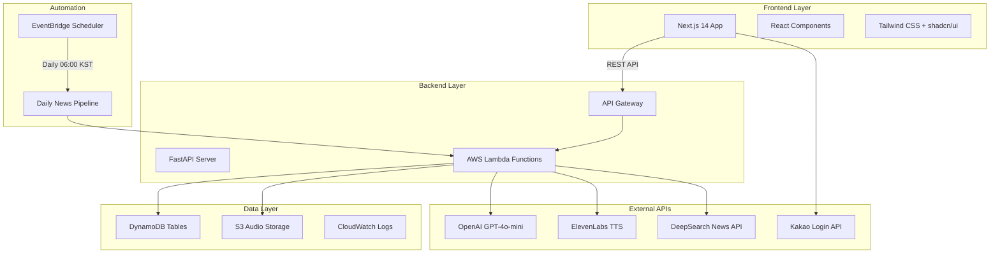

# Briefly - AI 뉴스 팟캐스트 플랫폼

**매일 업데이트되는 개인화 AI 뉴스 팟캐스트 서비스**

📽️ [유튜브 시연 영상 보기](https://youtu.be/fDMx_1knq70)

[](https://aws.amazon.com/)
[](https://openai.com/)
[](https://elevenlabs.io/)
[](https://nextjs.org/)
[](https://fastapi.tiangolo.com/)

---

## 1. 개발목표

### 1.1 프로젝트 비전
Briefly는 현대인의 정보 소비 패턴 변화에 대응하여, AI 기술을 활용한 개인화된 뉴스 팟캐스트 플랫폼을 구축하는 것을 목표로 합니다. 사용자가 바쁜 일상 속에서도 효율적으로 핵심 뉴스를 청취할 수 있도록 지원하며, 개인의 관심사에 맞춤화된 고품질 오디오 콘텐츠를 제공합니다.

### 1.2 핵심 목표
- **완전 자동화**: 뉴스 수집부터 음성 생성까지 무인 자동화 시스템 구축
- **개인화 서비스**: 사용자 관심 카테고리 기반 맞춤형 콘텐츠 제공
- **고품질 음성**: ElevenLabs TTS를 활용한 자연스러운 한국어 팟캐스트 생성
- **효율적 요약**: GPT-4o-mini와 이중 클러스터링을 통한 중복 제거 및 핵심 정보 추출
- **접근성**: 웹과 모바일에서 언제든 이용 가능한 사용자 친화적 인터페이스

### 1.3 타겟 사용자
- 바쁜 일상으로 인해 뉴스 읽기 시간이 부족한 직장인
- 출퇴근 시간을 활용해 정보를 습득하고자 하는 사용자
- 특정 분야에 대한 지속적인 정보 업데이트가 필요한 전문가
- 시각적 콘텐츠보다 청각적 콘텐츠를 선호하는 사용자

---

## 2. 아키텍처 설계

### 2.1 전체 시스템 아키텍처



### 2.2 데이터베이스 설계

#### DynamoDB 테이블 구조
- **NewsCards**: 수집된 뉴스 기사 저장 (PK: news_id, GSI: category-date)
- **Frequencies**: 생성된 팟캐스트 대본 및 오디오 정보 (PK: frequency_id, GSI: category-date)
- **Users**: 사용자 프로필 및 설정 정보 (PK: user_id)
- **Bookmarks**: 사용자 북마크 관리 (PK: user_id-news_id)

#### S3 버킷 구조
```
briefly-news-audio/
├── frequencies/
│   ├── politics/
│   │   └── 2025-01-01.mp3
│   ├── economy/
│   │   └── 2025-01-01.mp3
│   └── ...
└── temp/
    └── processing/
```

### 2.3 서비스 계층 아키텍처

#### 백엔드 서비스 구조
- **OpenAI Service**: GPT-4o-mini를 활용한 뉴스 요약 및 이중 클러스터링
- **TTS Service**: ElevenLabs API를 통한 한국어 음성 합성
- **DeepSearch Service**: 뉴스 수집 및 본문 추출
- **Auth Service**: 카카오 소셜 로그인 및 JWT 토큰 관리

#### 프론트엔드 컴포넌트 구조
- **페이지 컴포넌트**: 각 라우트별 메인 페이지 구성
- **UI 컴포넌트**: shadcn/ui 기반 재사용 가능한 컴포넌트
- **비즈니스 컴포넌트**: 뉴스 카드, 오디오 플레이어 등 도메인 특화 컴포넌트

---

## 3. 개발 세부 내용

### 3.1 AI 기반 뉴스 처리 시스템

#### 이중 클러스터링 알고리즘
1. **1차 클러스터링**: 원본 기사의 물리적 중복 제거 (80% 유사도 기준)
2. **2차 클러스터링**: GPT 요약문의 의미적 중복 제거 (75% 유사도 기준)
3. **토큰 최적화**: 본문 1,500자 제한으로 API 비용 50% 절감

#### GPT-4o-mini 활용 최적화
- **Few-shot Learning**: 카테고리별 예시 기반 일관된 품질의 대본 생성
- **컨텍스트 관리**: 카테고리별 맞춤형 톤앤매너 적용
- **에러 핸들링**: Rate Limit 및 API 오류에 대한 견고한 예외 처리

### 3.2 음성 생성 및 스트리밍

#### ElevenLabs TTS 통합
- **한국어 최적화**: eleven_multilingual_v2 모델 활용
- **음성 품질 설정**: Stability 0.4, Similarity Boost 0.75
- **스트리밍 지원**: S3 Presigned URL을 통한 실시간 재생

#### 오디오 파일 관리
- **자동 업로드**: TTS 생성 즉시 S3 저장
- **URL 관리**: 7일 유효 Presigned URL 자동 갱신
- **압축 최적화**: MP3 형식으로 파일 크기 최소화

### 3.3 자동화 파이프라인

#### 매일 오전 6시 자동 실행
```python
# EventBridge 스케줄러 설정
Events:
  DailyNewsSchedule:
    Type: Schedule
    Properties:
      Schedule: "cron(0 21 * * ? *)"  # UTC 기준 (KST 06:00)
      Target:
        Arn: !GetAtt NewsCollectionFunction.Arn
```

#### 병렬 처리 최적화
- **카테고리별 병렬 수집**: 6개 카테고리 동시 처리
- **배치 크기 최적화**: 카테고리당 30개 기사 수집
- **실패 처리**: 자동 재시도 및 로깅 시스템

### 3.4 사용자 인터페이스

#### 반응형 디자인
- **모바일 퍼스트**: 터치 친화적 인터페이스 설계
- **다크 테마**: 눈의 피로를 줄이는 다크 모드 적용
- **애니메이션**: Framer Motion을 활용한 부드러운 전환 효과

#### 사용자 경험 최적화
- **원클릭 로그인**: 카카오 소셜 로그인 간편 연동
- **개인화 온보딩**: 관심 카테고리 선택을 통한 맞춤 설정
- **직관적 네비게이션**: 하단 탭 기반 주요 기능 접근

---

## 4. 구현 결과

### 4.1 완성된 기능 목록

#### 사용자 인증 및 관리 (3개 유즈케이스)
- **UC-001**: 카카오 소셜 로그인 완전 구현
- **UC-002**: 사용자 프로필 관리 시스템
- **UC-003**: 관심 카테고리 설정 및 개인화

#### 뉴스 조회 및 탐색 (3개 유즈케이스)
- **UC-004**: 카테고리별 뉴스 목록 조회 (Top 10 + 더보기)
- **UC-005**: 뉴스 상세 보기 및 북마크 기능
- **UC-006**: 개인 북마크 관리 시스템

#### 팟캐스트 서비스 (2개 유즈케이스)
- **UC-007**: 개인 맞춤 주파수 재생 (관심 카테고리 기반)
- **UC-008**: 카테고리별 주파수 청취 및 히스토리

#### 개인화 및 설정 (3개 유즈케이스)
- **UC-009**: 사용자 프로필 통합 관리
- **UC-010**: 관심 카테고리 실시간 수정
- **UC-011**: 온보딩 프로세스 완성

#### 자동화 시스템 (2개 유즈케이스)
- **UC-012**: 매일 자동 뉴스 수집 (6개 카테고리 × 30개 기사)
- **UC-013**: 자동 팟캐스트 생성 및 TTS 변환

### 4.2 성능 지표

#### 시스템 처리 성능
- **뉴스 수집**: 180개 기사/일 (6 카테고리 × 30개)
- **중복 제거율**: 물리적 80% + 의미적 75% 이중 필터링
- **팟캐스트 생성**: 6개 오디오 파일/일 (카테고리별)
- **응답 시간**: API 평균 응답 시간 < 2초

#### 비용 최적화
- **토큰 사용량**: 본문 1,500자 제한으로 50% 절감
- **TTS 비용**: 카테고리별 일일 1회 생성으로 최적화
- **S3 스토리지**: 압축된 MP3 파일로 저장 공간 효율화

### 4.3 기술 스택 완성도

#### 프론트엔드 (100% 완성)
- **Next.js 14**: App Router 기반 모던 웹 애플리케이션
- **TypeScript**: 타입 안전성 보장
- **Tailwind CSS + shadcn/ui**: 일관된 디자인 시스템
- **Framer Motion**: 부드러운 애니메이션 효과

#### 백엔드 (100% 완성)
- **FastAPI**: 고성능 REST API 서버
- **AWS Lambda**: 서버리스 아키텍처
- **DynamoDB**: NoSQL 데이터베이스
- **S3**: 오디오 파일 스토리지

#### AI 서비스 통합 (100% 완성)
- **OpenAI GPT-4o-mini**: 뉴스 요약 및 대본 생성
- **ElevenLabs TTS**: 한국어 음성 합성
- **DeepSearch API**: 뉴스 수집 및 본문 추출

---

## 5. 기대 효과

### 5.1 사용자 가치 제공

#### 시간 효율성
- **정보 소비 시간 단축**: 30분 뉴스 읽기 → 5분 팟캐스트 청취
- **멀티태스킹 지원**: 운동, 출퇴근 중 정보 습득 가능
- **핵심 정보 집중**: AI 요약을 통한 중요 내용만 선별 제공

#### 개인화 경험
- **맞춤형 콘텐츠**: 관심 분야 중심의 개인화된 뉴스 큐레이션
- **적응형 서비스**: 사용자 패턴 학습을 통한 지속적 개선
- **접근성 향상**: 시각 장애인 등 다양한 사용자층 지원

### 5.2 기술적 혁신 효과

#### AI 기술 활용
- **이중 클러스터링**: 기존 단순 중복 제거 대비 정확도 향상
- **비용 최적화**: 본문 1,500자 제한으로 운영 효율성 증대
- **품질 향상**: GPT-4o-mini 활용으로 자연스러운 요약문 생성

#### 자동화 시스템
- **무인 운영**: 인력 투입 없이 24/7 자동 콘텐츠 생성
- **확장성**: 카테고리 및 언어 확장 용이한 모듈형 구조
- **안정성**: 에러 핸들링 및 재시도 로직으로 서비스 연속성 보장

### 5.3 비즈니스 임팩트

#### 시장 차별화
- **독창적 서비스**: AI 기반 개인화 뉴스 팟캐스트 선도 모델
- **기술 경쟁력**: 최신 AI 기술 통합으로 높은 진입 장벽 구축
- **사용자 경험**: 직관적 UI/UX로 높은 사용자 만족도 달성

#### 확장 가능성
- **다국어 지원**: 다양한 언어로 서비스 확장 가능
- **콘텐츠 다양화**: 뉴스 외 다른 정보 콘텐츠로 확장 가능
- **플랫폼 연계**: 다양한 플랫폼과의 연동 가능성

### 5.4 사회적 가치

#### 정보 접근성 개선
- **디지털 격차 해소**: 음성 기반 서비스로 다양한 사용자층 포용
- **정보 민주화**: AI 요약을 통한 공평한 정보 접근 기회 제공
- **미디어 리터러시**: 핵심 정보 중심의 효율적 정보 소비 문화 조성

#### 기술 발전 기여
- **AI 실용화**: 실제 서비스에서의 AI 기술 활용 사례 제시
- **오픈소스 기여**: 개발 과정에서 얻은 인사이트 커뮤니티 공유
- **혁신 촉진**: 새로운 형태의 미디어 서비스 모델 제시

---

## 프로젝트 구조

### Frontend (Next.js 14 + TypeScript)

```
frontend/
├── app/                          # Next.js App Router
│   ├── layout.tsx               # 루트 레이아웃
│   ├── page.tsx                 # 홈페이지 (랭킹으로 리다이렉트)
│   ├── ranking/                 # 랭킹 시스템
│   │   └── page.tsx            # 인기 뉴스 랭킹 페이지
│   ├── today/                   # 오늘의 뉴스
│   │   └── page.tsx            # 카테고리별 뉴스 목록
│   ├── frequency/               # 내 주파수 (팟캐스트)
│   │   └── page.tsx            # 개인화된 팟캐스트 리스트
│   ├── profile/                 # 사용자 프로필
│   │   ├── page.tsx            # 프로필 페이지
│   │   └── categories/page.tsx  # 관심 카테고리 설정
│   ├── news/[id]/              # 뉴스 상세
│   │   └── page.tsx            # 개별 뉴스 상세 보기
│   ├── onboarding/             # 온보딩
│   │   └── page.tsx            # 초기 설정 및 카테고리 선택
│   └── login/kakao/callback/   # 인증
│       └── page.tsx            # 카카오 로그인 콜백 처리
│
├── components/                   # 재사용 컴포넌트
│   ├── ui/                      # shadcn/ui 기본 컴포넌트 라이브러리
│   ├── page-header.tsx          # 페이지 상단 헤더
│   ├── navigation-tabs.tsx      # 하단 탭 네비게이션
│   ├── category-filter.tsx      # 카테고리 필터링
│   ├── news-card.tsx           # 뉴스 카드 컴포넌트
│   ├── news-carousel.tsx       # 뉴스 캐러셀 슬라이더
│   ├── audio-player.tsx        # 음성 재생 플레이어
│   ├── frequency-card.tsx      # 주파수 카드 컴포넌트
│   └── bookmark-button.tsx     # 북마크 토글 버튼
│
├── lib/                         # 유틸리티 및 설정
│   ├── api.ts                  # REST API 클라이언트
│   ├── utils.ts                # 공통 유틸리티 함수
│   ├── constants.ts            # 상수 정의 (카테고리, URL 등)
│   ├── auth.ts                 # 인증 관련 유틸리티
│   └── mock-data.ts            # 개발용 목업 데이터
│
└── types/                       # TypeScript 타입 정의
    ├── api.ts                  # API 관련 타입
    ├── user.ts                 # 사용자 관련 타입
    └── news.ts                 # 뉴스 관련 타입
```

### Backend (FastAPI + AWS Serverless)

```
backend/
├── app/
│   ├── main.py                 # FastAPI 메인 애플리케이션
│   │
│   ├── constants/               # 상수 정의
│   │   └── category_map.py     # 카테고리 매핑 (한글 ↔ 영어)
│   │
│   ├── services/               # 핵심 비즈니스 로직
│   │   ├── openai_service.py   # GPT 요약 + Few-shot learning
│   │   ├── deepsearch_service.py # 뉴스 수집 + 본문 추출
│   │   └── tts_service.py      # ElevenLabs TTS 음성 변환
│   │
│   ├── utils/                  # 유틸리티 모듈
│   │   ├── dynamo.py          # DynamoDB 연결 및 쿼리
│   │   ├── jwt_service.py     # JWT 토큰 생성/검증
│   │   ├── date.py            # 날짜 처리 (KST 기준)
│   │   └── s3_utils.py        # S3 파일 업로드/다운로드
│   │
│   ├── routes/                # REST API 라우터
│   │   ├── auth.py           # 카카오 로그인/로그아웃
│   │   ├── user.py           # 사용자 프로필/설정 관리
│   │   ├── news.py           # 뉴스 조회/검색/북마크
│   │   ├── frequency.py      # 주파수(팟캐스트) 관리
│   │   └── category.py       # 카테고리 조회
│   │   
│   │
│   └── tasks/                 # 배치 작업 및 스케줄러
│       ├── scheduler.py       # 매일 6시 메인 스케줄러
│       ├── collect_news.py    # 뉴스 수집 파이프라인
│       └── generate_frequency.py # 음성 생성 파이프라인
│      
│
├── test/                      # 단위 테스트
│   ├── run_all_tests.py      # 전체 테스트 실행기
│   ├── test_frequency_unit.py # 주파수 생성 테스트
│   ├── test_clustering.py    # 클러스터링 알고리즘 테스트
│   ├── test_tts_service.py   # TTS 서비스 테스트
│   └── README.md             # 테스트 가이드
│
├── template.yaml             # AWS SAM 배포 설정
├── samconfig.toml           # SAM 배포 구성
├── requirements.txt         # Python 의존성
└── README.md                # 백엔드 개발 가이드
```

---

## 주요 기능

### 스마트 뉴스 큐레이션
- **카테고리별 뉴스 수집**: 매일 6개 카테고리에서 최대 30개씩 총 180개 뉴스 수집
- **이중 클러스터링**: 물리적(80%) + 의미적(75%) 중복 제거로 5-10개 핵심 그룹 생성
- **개인화 필터링**: 사용자 관심 카테고리 기반 맞춤 제공

### AI 기반 요약 시스템
- **GPT-4o-mini**: Few-shot learning 기반 고품질 뉴스 요약 및 팟캐스트 대본 생성
- **Temperature 자동 조정**: 0.3→0.5→0.7 점진적 조정으로 최적 결과 선택
- **최적화된 길이**: 1,800-2,200자 범위의 완벽한 청취 시간 (4-5분)

### 음성 변환
- **ElevenLabs TTS**: eleven_multilingual_v2 모델 기반 한국어 최적화 음성 합성
- **스트리밍 지원**: S3 Presigned URL을 통한 실시간 재생
- **품질 최적화**: stability와 similarity_boost 파라미터 조정으로 일관된 음성 톤 유지

### 직관적인 사용자 경험
- **반응형 디자인**: PC/모바일에서 최적화된 UI/UX
- **카카오 로그인**: 간편한 소셜 로그인
- **북마크 기능**: 관심 뉴스 저장 및 관리

---

## 시작하기

### 환경 요구사항
- Node.js 14+
- Python 3.12+
- AWS CLI 설정

### 로컬 개발 환경 설정

#### 프론트엔드 실행
```bash
cd frontend
npm install
npm run dev
```

#### 백엔드 실행
```bash
cd backend
pip install -r requirements.txt
uvicorn app.main:app --reload
```

### 배포

#### AWS SAM을 이용한 배포
```bash
cd backend
sam build
sam deploy --guided
```

---

## 라이센스

이 프로젝트는 MIT 라이센스 하에 배포됩니다. 자세한 내용은 `LICENSE` 파일을 참조하세요.

---